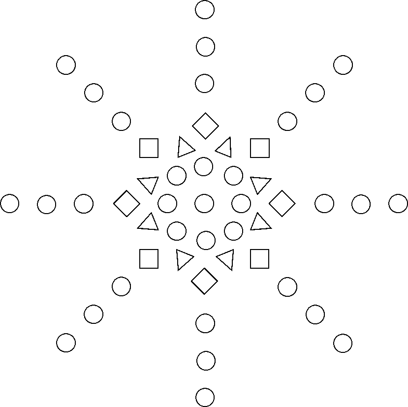

# Language Proposal: Mandala
##### September 30, 2015 

| Name        | Uni           | Role  |
| ------------- |:-------------:| -----:|
| **Edo Roth**     | `enr2116` | *Tester* |
| **Harsha Vemuri**    | `hv2169`      |   *System Architect* |
| **Kanika Verma** | `kv2253`     |    *Project Manager* |
| **Samantha Wiener** | `srw2168`     |    *Language Guru* |



## Motivation
Mandala is a programming language to facilitate the process of creating symmetric, geometric designs. The language draws its inspiration from mandalas, circular figures that exhibit both rotational and reflectional symmetry. (Some consider the Mandala to be a spiritual symbol representing the universe.) While this is our central inspiration, our language will allow people to create their own artistic designs programmatically. 

Mandala proposes to take advantage of the computational accuracy that would allow users to define geometrically symmetric patterns, while giving users the flexibility to create their own designs and realize them digitally in a simple way. 

We also wanted to confine the space of our language to work on creating an intuitive workflow for the user to create their own art. In addition to its use for artists, we envision Mandala being used as an educational tool to help beginner programmers understand computer programming. For example, the way we define a for loop (as described below) is an intuitive way of understanding how to iterate through different elements in an array by modifying a mandala layer by layer. 

## Language Features 
This language shields the programmer from being required to use involved graphics programs by abstracting away the construction of many foundational elements of the Mandala. For instance, we take into account that a Mandala is built layer by layer, so the language is designed to allow the user to build one layer at a time. Moreover, we have a set of built-in types that represent various shapes (circles, triangles, and squares) that the user may wish to include in the figure. 

The user will create individual custom layers with shapes that have defined size, color, and rotation. Each layer is a circular structure, placing its specified shape around its outer radius with a specified radius, number of shapes, and rotational offset.

To make program structure clean and intuitive, there are no terminating semicolons, parentheses for parameters, or curly brackets. Instead, whitespace is used to define parameters for created objects.

## Building Blocks
#### Built-In Types and Operators
##### Integer and Double 
Our Integer and Double types are defined in the conventional way. These types will support conventional operators such as addition, subtraction, multiplication, division, greater than, greater than or equal to, less than or equal to, and equal to.

<br>

##### String
We will define strings in the same convention as C++. 

##### Mandala
The language allows the user to create a Mandala consisting of layers that are each composed of geometric shapes. The user will first declare the Mandala object (it is possible to write a program that generates multiple Mandalas).

##### Layer
The user will declare a new layer by defining its radius, the type of shape it will consist of, how many of these shapes, and an offset that determines the rotation of the layer. Every mandala will be fundamentally built by combining different layers.

##### Shape
The user may use one of the built-in shape types. When declaring the usage of a shape, the user specifies its size and color. The rotational offset of the shape is automatically generated in order to make the figure symmetric. The shape is independent of the layer which is independent of the Mandala, rather than an instance of the Mandala object. Therefore the user must add the shapes to the layer and each layer to the Mandala. Shape will take a parameter of Circle, Triangle or Square to create a new shape. 

##### Circle, Triangle, Square
These are three built in shapes that users will pass in as a parameter when they are creating their custom designs for each layers in the mandala. 

#### Style
Types are written with the first character capitalized; reserved keywords are all lowercase. Comments are only single-line, and are indicated by an octothorpe (#) at the beginning of a line. Empty lines are ignored, but indentation is important, indicating a parameter definition or entry into a for loop.

#### Keywords
`create`, `addTo`, `foreach`, `to`, `type`, `radius`, `size`, `color`, `rotation`, `offset`, `draw`, `while`, `break`, `continue`

<br>

#### Reserved
`:`,`=`, `+`, `-` , `*`, `/`, `#`

## Example Source Code

```
create Mandala m

create Layer layer1
  radius 3

create Shape circle1
  type Circle
  size 3
  color yellow
  rotation 0

create Shape triangle1
  type Triangle
  size 3
  color green
  rotation 0

create Shape square1
  type Square
  size 4
  color blue
  rotation 45

create Layer layer2
  radius 10
  Shape circle1
  count 8
  offset 0

create Layer layer3
  radius 15
  Shape triangle1
  count 8
  offset 22.5

create Layer layer4
  radius 20
  Shape square1
  count 8
  offset 22.5

addTo m: layer1 layer2 layer3 layer4 

create Integer latestRadius = 25

foreach i = 1 to i = 5 
  create Layer currentLayer
    radius latestRadius
    Shape circle1
    count 8
    offset 0
  add m: currentLayer
  latestRadius = latestRadius + 5

draw m
```

